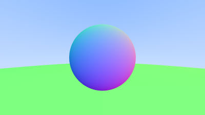
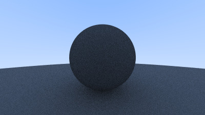
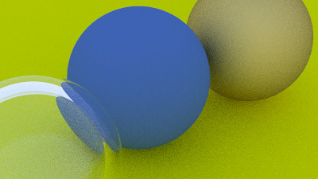

# Ray Tracing Series

## Build

```bash
cmake -B build
cmake --build build -j${nproc}
```

# Notes

## PPM image format

create `ppm` image

```bash
cmake --build build -j${nproc}
./build/main > image.ppm
```


```txt
P3
256 256
255
0 0 0
1 0 0
2 0 0
3 0 0
4 0 0
5 0 0
6 0 0
7 0 0
8 0 0
9 0 0
10 0 0
11 0 0
12 0 0
...
```

## Sending rays to the scene

We got this blue-to-white gradient depending on ray Y coordinate.


## A simiple red sphere


## A sphere colored according to its normal vectors


## Normals-colored sphere with ground


## Antialiasing



## A diffuse sphere



## Gamma correction


## Metal


## Glass


Total internal reflection: Air bubble sometimes refracts, someties reflects


Hollow glass sphere


## Camera fov

A wide-angle view


A distant view


Zooming in



## Defocus blur


